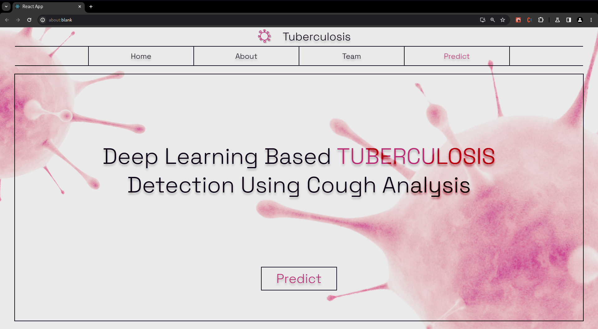

# Tuberculosis Detection Website (Work In-Progress)

This is a web application built using React and Flask that allows users to connect and use a Tuberculosis (TB) detection machine learning model. The application provides a user-friendly interface for uploading **_Cough Sounds_** and obtaining predictions about the presence of TB using the pre-trained ML model.



## Installation

1. Clone the repository:

   ```bash
   git clone https://github.com/harish3124/tb-detection-web.git
   ```

2. Navigate to the project directory:

   ```bash
   cd tb-detection-web
   ```

3. Install the dependencies for the Flask backend:

   ```bash
   poetry install
   ```

4. Install the dependencies for the React frontend:

   ```bash
   cd client
   npm install
   ```

## Usage

1. Start the Flask backend server:

   ```bash
   poetry shell
   flask --app server.py
   ```

2. In a separate terminal, start the React development server:

   ```bash
   cd client
   npm start
   ```
